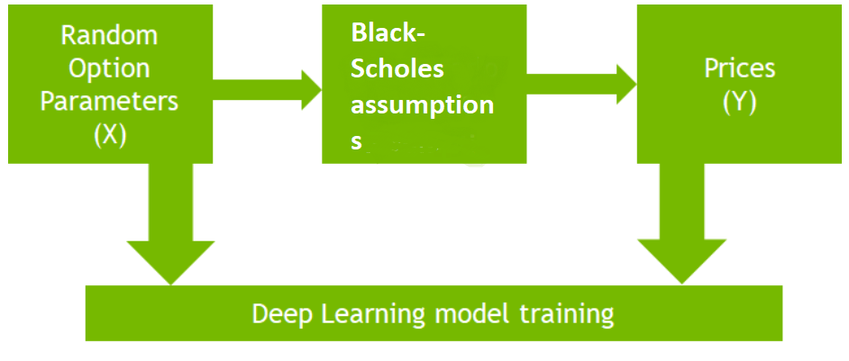
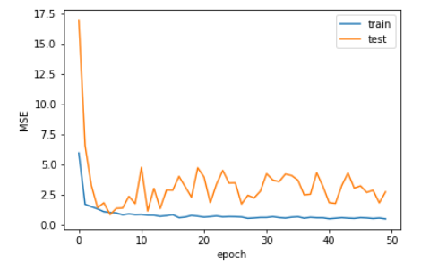

# Problem Statement : European Basket option pricing with neural network and Monte Carlo solver

Context : A client wants to explore novel methodologies for accelerating the pricing of
exotic derivatives.

A detailed explanation of the work can be found in the notebook : [Basket_Pricing](https://github.com/MariumAZ/Basket_Pricing/blob/main/Basket_Pricing.ipynb)

We approach this problem using two methods : 

- Neural Network
- Monte Carlo solver

and in this work we will be dealing only with European basket call.

# Steps : 

**1 .Build and train a neural network model for pricing European Basket options under Black-Scholes assumptions** 

Before building the Neural network we need to generate data .

The first step is to create a set of combinations of model, option and market parameters (strike, maturities, volatility, riskfree rate, ...) 

Based on  this paper : [Machine-Learning-methods-Coperneec](https://canopee-group.com/wp-content/uploads/2020/12/Machine-Learning-methods-Coperneec.pdf) 
the features to select are : 

- Maturity (yearly)
- Risk
- the ratio S/k (Moneyness) 
- Volatility

we could also add correlation  between assets as part of the features but this wasn't done in this work .

The model is built using the functional API of keras . It is composed of Dense layers, BatchNormalization layer and Dropout layer to prevent overfitting . The last layer is a Dense layer with 1 neuron as we are dealing with a regression problem and an activation function : relu because the Price option needs to be at least 0. We compile the model using MSE.

After running the model the plotting of the model performance is given by the figure below:

**2. Compare prices to a traditional numerical solver such as Monte-Carlo, Finite Difference or any other methodology you may deem applicable.**

In a second time we produced results using Monte carlo simulations applied on test data .
And we deduced a comparison of times between the two approaches .
From  our experiment : with 10 000 data points and with 3000 data points on the test set the Neural network model needs  0.12 seconds to run and the MC algorithm needs 9.85 seconds to run. So Neural Networks are pretty much faster than MC solver especially when our data set increases.

**3.Compare to the case of 1 asset**

In the case of 1 asset we reduce the correlation matrix to one dimension, previously it was initialized randomly and we can use same model.

# Further Work : 

1. Optimization

In case we are dealing with a big amount of data points we can make use of the tf.Data Api provided by tensorflow to make it easier for us to batch and shuffle our data.

2. Hyperparameter Tuning

We can tune the model parameters like learning rate , batch_size, hidden_size using  keras Tuner:

# Bibliography : 

1. [Machine-Learning-methods-Coperneec](https://canopee-group.com/wp-content/uploads/2020/12/Machine-Learning-methods-Coperneec.pdf)
2. [Accelerating-python-for-exotic-option-pricing](https://developer.nvidia.com/blog/accelerating-python-for-exotic-option-pricing/)
3. [github.com/shrentseng/Numerical-methods-for-option-pricing](https://github.com/shrentseng/Numerical-methods-for-option-pricing/blob/main/Monte%20Carlo%20simulation%20option%20pricing.ipynb)

